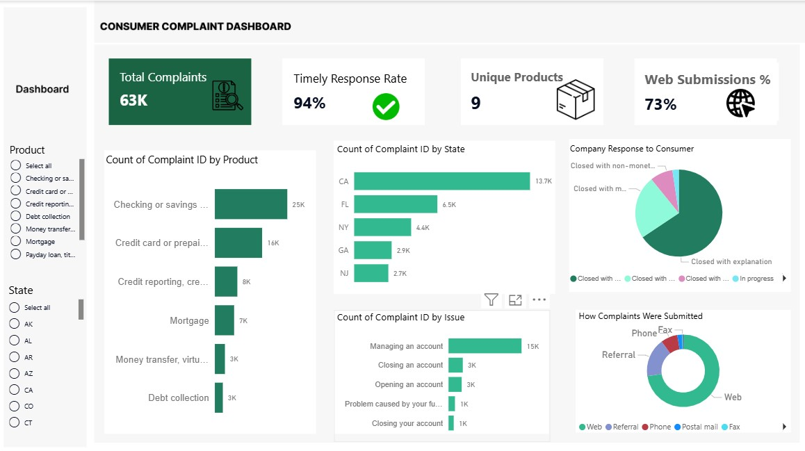

# consumer-complaints-analysis
Analysis of 62,516 consumer complaints using SQL. Identifies complaint patterns, geographic hotspots, and response effectiveness through 13 business-focused queries.
# Consumer Complaints Analysis

## Project Overview
Analysis of 62,516 consumer complaint records to identify patterns, response effectiveness, and improvement opportunities.

## Problem
Companies receive thousands of complaints but lack visibility into:
- Which products generate most complaints
- Which geographic regions have hotspots
- How fast complaints are resolved
- Common complaint issues

## Solution
13 SQL queries analyzing complaint patterns across products, states, and response methods.

## Key Findings
- Top 5 products account for 40-50% of complaints
- Complaints concentrated in specific states
- Response times vary significantly by product
- Mix of monetary relief and explanation-only responses

## Files
- `consumer_query.sql` — 13 analytical SQL queries for consumer complaints analysis.
- `Consumer_Complaints_Business_Questions_Document.docx` - Explanation of each query
-  `Consumer_Complaints_Dashboard.jpg` — Interactive dashboard visualizing key complaint trends and insights.

## Skills Demonstrated
- SQL query writing (aggregations, GROUP BY, filtering)
- Business analysis thinking
- Data pattern identification
- Customer satisfaction metrics

## Dashboard Preview

## Tools
- SQL Server
- power bi
- Data analysis
